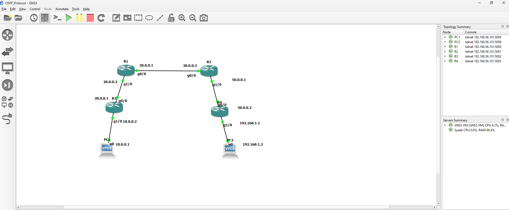

# OSPF 4 Router Lab (GNS3)

## 📌 Overview
This project demonstrates OSPF configuration in a 4-router topology using GNS3. The lab verifies end-to-end connectivity between two PCs across multiple routers.

---

## 🖼️ Topology

---

## 🧠 Technologies Used
- OSPF (Area 0)
- Cisco IOS (Dynamips)
- GNS3
- VPCS

---

## 🌐 IP Addressing

| Device | Interface | IP Address |
|--------|----------|------------|
| R1 | G0/0 | 30.0.0.1 |
| R1 | G1/0 | 20.0.0.2 |
| R2 | G0/0 | 30.0.0.2 |
| R2 | G1/0 | 50.0.0.1 |
| R3 | G0/0 | 20.0.0.1 |
| R3 | G1/0 | 10.0.0.2 |
| R4 | G0/0 | 50.0.0.2 |
| R4 | G1/0 | 192.168.1.1 |
| PC1 | e0 | 10.0.0.1 |
| PC2 | e0 | 192.168.1.2 |

---

## ⚙️ Configuration
- OSPF configured in **Area 0**
- All routers form adjacency
- Routes are dynamically learned

---

## ✅ Result
- Successful ping from **PC1 → PC2**
- End-to-end connectivity verified

---

## 📂 Files Included
- Router configs (R1, R2, R3, R4)
- PC configs
- Topology image

---

## 🚀 Author
**Syeeb Uddin Mallick**